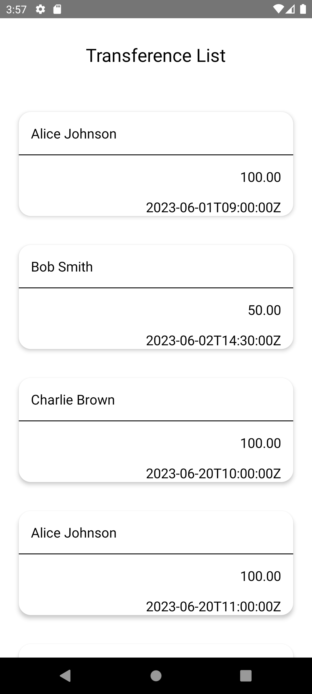
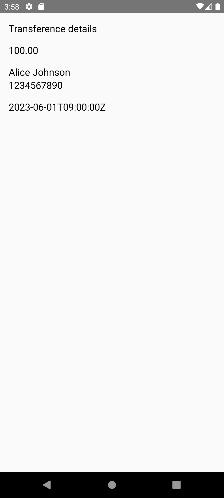

# transferGenAi

TransferGenAi is an Android application developed in Kotlin. The application displays a list of 
fictitious transfers. Each item in the list represents a transfer, and when clicked, it navigates 
to a details page where more information about the transfer can be found.

## Features

- **List of Transfers**: The application displays a list of transfers. Each item in the list 
represents a single transfer with basic information such as sender name and transfer amount.

- **Transfer Details**: When a user clicks on a transfer item in the list, the application 
navigates to a details page. This page provides more detailed information about the transfer.

## Development

The development of this application was greatly assisted by GitHub Copilot, an AI-powered code 
completion tool. GitHub Copilot was able to generate code based on the prompts provided in each 
scope of the application. This significantly sped up the development process and allowed for more 
focus on the design and functionality of the application.

 
 
 

The application follows the Model-View-ViewModel (MVVM) architectural pattern, which separates the 
application into three main components: the Model, which handles the data and business logic; the 
View, which displays the user interface and receives user input; and the ViewModel, which acts as a 
bridge between the Model and the View.

> Please note that this application is a demonstration and the transfers displayed are fictitious.